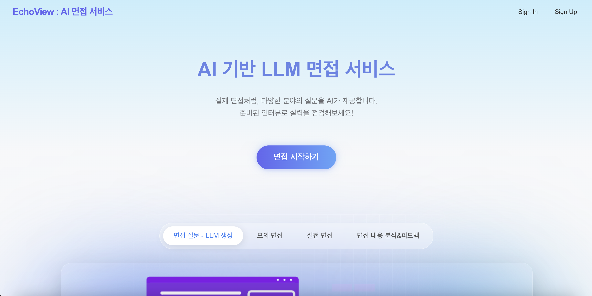
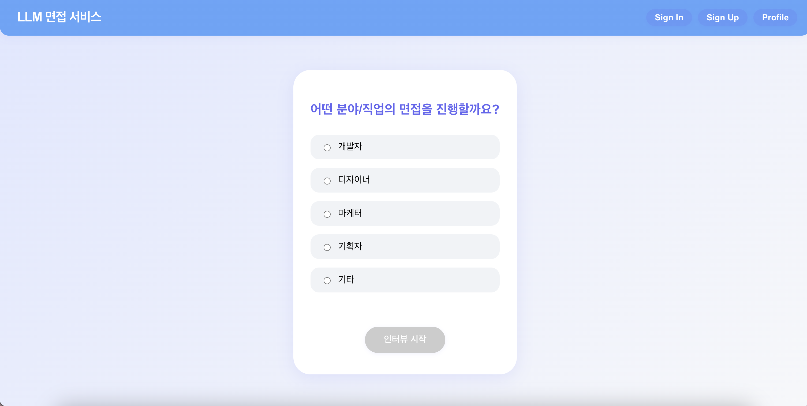
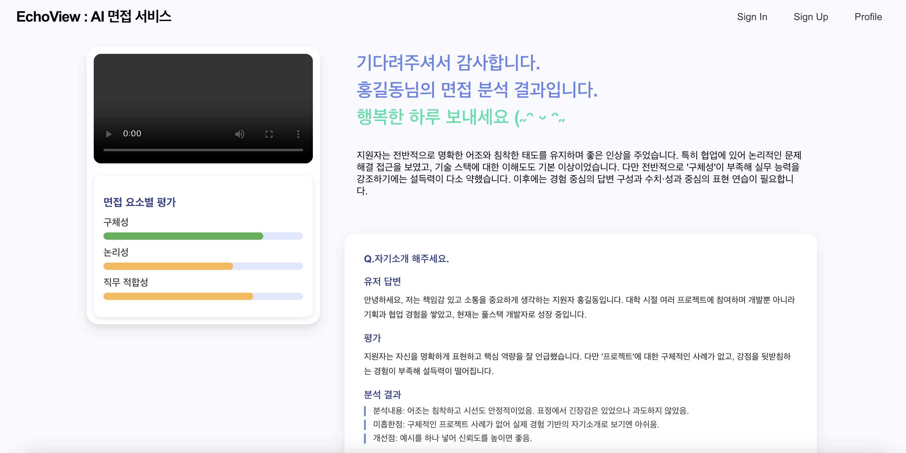

# LLM Interview Service

### ✨ TEAM MEMBER
<table>
  <tbody>
    <tr>
      <td align="center"><a href="https://github.com/"> <b>PM/BE | 유채민</b></a> </td>
      <td align="center"><a href="https://github.com/jeonghyeonmin1"> <b>FE | 정현민</b></a> </td>
      <td align="center"><a href="https://github.com/song-hae-in"> <b>BE | 송해인</b></a> </td>
      <td align="center"><a href="https://github.com/SPIDEY1876"> <b>FE | 김동언</b></a> </td>
  </tbody>
</table>
 
## 프로젝트 소개
AI 기반 LLM(대형언어모델) 면접 서비스입니다. 사용자는 다양한 직업/전공을 선택해 실제 면접처럼 질문에 답변하고, 결과와 피드백을 확인할 수 있습니다. 카카오 로그인, 프로필 관리, 인터뷰 내역 저장 등 실제 서비스에 가까운 UX를 제공합니다.

## 서비스 화면

- Home: 서비스 소개 및 면접 시작
- SelectJob: 분야/직업 선택

- Interview: 직업별 면접 진행, 답변 입력, 진행률 표시
- Result/Profile: 내 정보, 인터뷰 내역, 피드백

- Sign In/Sign Up: 카카오 로그인 및 회원가입

## 기술 스택
- React (CRA 기반)
- React Router
- Context API (전역 상태 관리)
- Styled CSS (프리미엄 UI)
- 카카오 로그인 연동 (SDK/REST API)

---

> 본 프로젝트는 실제 LLM 기반 면접 서비스의 프론트엔드 MVP 예시입니다. 추가 기능 및 백엔드 연동은 확장 가능합니다.
